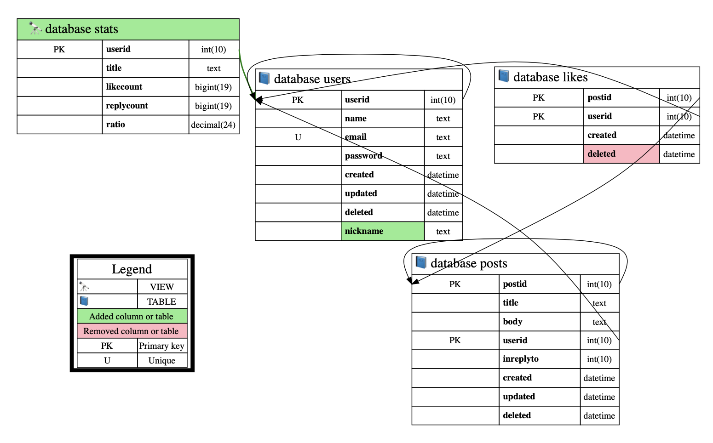
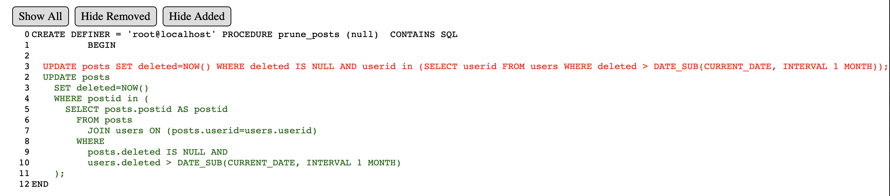

# ERDiff

  generate Entity Relationship Diagram with differences

## DESCRIPTION

A Database diffing and diagramming tool.  Generate diffable snapshots of your schema or generate diffs between versions viewable in a browser.  Use it to compare environments before deploys or as part of your process(pull requests, CI, Deployments, etc).  The diffs include views and tables with relations plus stored procedures. There are a few ways to run the tool:

* snapshot - save ERD + stored procedures as a single html file
* save snapshot - save schema from a database
* online diff - diff two active databases 
* snapshot diff - diff two saved schemas
* online vs snapshot diff - diff an active database vs a snapshot
* sequential diff - save schema from a database, modifify the database and diff the current(new) schema against the saved schema.

## EXAMPLE

The output in the [example](example/) directory includes the [html](example/example.html) / [view page on github](https://htmlpreview.github.io/?https://github.com/inmotionsoftware/erdiff/blob/update-docs/example/example.html) output as well as [snapshot json](example/current_schema.json) and [graphviz](example/diff_dot.gv) output.





## INSTALL

Install globally on your system with npm `sudo npm install -g erdiff` or yarn `sudo yarn global add erdiff`

To use it in a project `npm install erdiff` or `yarn add erdiff`

## USAGE

Example diffing two postgres databases `staging-host` and `prod-host` 
```Shell
$ erdiff -s public -s otherschema -c 'postgres://user@pass:staging-host:5432/database' -p 'postgres://user@pass:prod-host:5432/database' > output.html
```

Example of diffing the same database at different times, this could be done as part of a CI process

```Shell
# migrate database to revision A
$ export DB_CURRENT=mysql://user@pass:localhost/database
$ export DB_SCHEMA=first,second,third
$ erdiff -q -f main-branch.schema
# migrate databse to revision B
$ erdiff -p main-branch.schema > output.html
```

### Dot generation from stored json

[Graphvis](https://graphviz.org) output can be generated for any schema as well as a diff between schemas. Specify a single(current) schema to simply generate a normal Entity Relation Diagram, or specify two schemas to generate a diagram with diff information.

```Shell
$ cd example
$ ../index.js -c current_schema.json -q -d current_dot.gv
$ ../index.js -c previous_schema.json -q -d previous_dot.gv
$ ../index.js -c current_schema.json -p previous_schema.json -q -d diff_dot.gv
```


## OPTIONS
  -c, --current=current    (required) mysql connection url or json file to
                           generate ERD from, when diffing this is the new
                           schema

  -d, --dot=dot            save graphviz dot file

  -f, --save=save          save schema data for diffing later

  -p, --previous=previous  mysql connection url or json file to using when
                           diffing, used as the previous schema

  -q, --quiet              do not output svg to stdout

  -s, --schema=schema      schema(s) to graph and optionally diff, use multiple times to include more than one schema

  --help                   show CLI help

## ENVIRONMENT VARIABLES

  * `DB_CURRENT`               environment version of -c option
  * `DB_PREVIOUS`              environment version of -p option
  * `QUIET`                    environment version of -q option
  * `DB_SCHEMA`                environment version of -s option, use comma seperated list to include more than one schema
  * `SAVE_SCHEMA`              environment version of -f option

